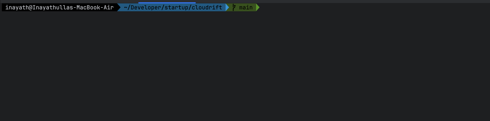

# cloudrift
Detect drift. Defend cloud.

[](LICENSE)

[](https://goreportcard.com/report/github.com/inayathulla/cloudrift)
[](https://tldrsec.com/p/tldr-sec-287)


🔍 **Cloudrift** is an open-source cloud drift detection tool that helps you identify when your cloud infrastructure no longer matches your Infrastructure-as-Code (IaC) — before it causes a security or compliance incident.

## 🚀 Featured

> **Cloudrift was featured in [TLDR Sec #287](https://tldrsec.com/p/tldr-sec-287)** — one of the most respected newsletters in security engineering.  
> Curated by [Clint Gibler](https://www.linkedin.com/in/clintgibler/), TLDR Sec is read by security teams at Google, Netflix, Segment, and many others.

---
## 🔍 How Cloudrift Differs from Other Tools

| Feature                          | Cloudrift                                | driftctl                                   | Terraform Drift Detect          |
|----------------------------------|------------------------------------------|--------------------------------------------|---------------------------------|
| **Source of Truth**              | Terraform Plan + Live AWS API            | Terraform State + Live AWS API             | Terraform State vs Live State   |
| **Timing**                       | Pre-apply (Plan-only)                    | Post-apply                                 | Post-apply                      |
| **Live Scan Independence**       | Separate AWS API scan, outside Terraform | In-memory Terraform refresh                | Terraform refresh only          |
| **Output Format**                | JSON attribute-level diffs               | CLI output (limited JSON/JSONPath support) | Human-readable diff             |
| **Custom Automation Integration**| Easy to ingest into dashboards & bots    | Requires parsing CLI output                | Not designed for machine parsing |
---
## 🎯 Who Benefits Most from Cloudrift

Cloudrift’s plan-first, API-backed approach is a game-changer for teams that need reliable drift detection **before** they hit “apply.” Here’s who gets the biggest lift:

1. **Early-stage Startups & Small Teams**
    - **Challenge:** No formal change-management process, manual reviews, high risk of “it worked in dev” surprises in prod.
    - **Example:**  
      RockingAI has a 4-engineer team managing customer data buckets in S3. An engineer bumps the bucket ACL to “public-read” in a local plan—but the mistake isn’t caught until after apply, exposing data.
    - **Cloudrift Benefit:**
        - Runs a plan-only scan and flags “public-read” on the S3 ACL **before** any changes land in AWS.
        - Emits a JSON diff that’s trivial to feed into a Slack bot or GitHub check run, enforcing guardrails with zero human toil.

2. **DevOps & Infrastructure Teams**
    - **Challenge:** You’ve got multiple environments (dev/stage/prod), rotating credentials and policies, and periodic compliance audits—but nobody’s tracking what drifted since last deploy.
    - **Example:**  
      FinHealthCo rotates IAM roles weekly. Last month, a stale policy attachment remained in prod and slipped through manual audits.
    - **Cloudrift Benefit:**
        - Schedules daily plan-only scans against prod via AWS API.
        - Generates machine-readable attribute diffs (e.g. removed policy ARN), driving automated remediation or alerts before drift accumulates.

3. **Compliance & Security-Focused Organizations**
    - **Challenge:** Auditors demand an immutable record of what **would** change, and when—not just what **did** change. State-vs-live tools only tell you post-apply mismatches.
    - **Example:**  
      RegulaBank needs proof that no security groups are ever opened to 0.0.0.0/0 without a policy exception.
    - **Cloudrift Benefit:**
        - Captures every denied change attempt in JSON logs, complete with timestamp and plan context.
        - Serves as an auditable, pre-apply “drift guard” that slots straight into your SIEM or compliance dashboard.

> **Why not driftctl or Terraform’s drift detect?**  
> While tools like **driftctl** catch state-vs-live drift **after** you’ve applied, Cloudrift prevents misconfigurations *before* they ever reach AWS—ideal for lean teams that can’t afford manual checks or have audit mandates to prove “nothing unsafe ever ran.”
---
## ✨ Features (In Progress)
- Detect drift between Terraform and live AWS state
- Catch unmanaged or deleted cloud resources
- Integrate into CI/CD pipelines
- Slack/email notifications
- Simple CLI and JSON output

---
## 🏁 Quick Start
### Clone the repository
```bash
git clone https://github.com/inayathulla/cloudrift.git
cd cloudrift
```
### 🔁 Using Cloudrift with your own Terraform projects

Cloudrift is designed to be used by developers to detect cloud resource drift in their own Terraform-based infrastructure projects.

### ✅ Example: compliance-export or vuln-export projects

Assume you have Terraform code stored in your repositories:
You will need to create config folder and place cloudrift.yml file.

```
~/projects/
├── compliance-export/
│   ├── main.tf
│   ├── variables.tf
│   ├── config/
│       └── cloudrift.yml
│   └── ...
└── vuln-export/
    ├── main.tf
    ├── config/
    │    └── cloudrift.yml
    └── ...
```
### 1. Navigate to your Terraform project
```bash
cd ~/projects/compliance-export
```

### 2. Generate a Terraform plan
```bash
terraform init
terraform plan -out=compliance.binary
terraform show -json compliance.binary > plan.json
```
Example of plan.json 
```json
{
  "resource_changes": [
    {
      "address": "aws_s3_bucket.cloudrift",
      "type": "aws_s3_bucket",
      "name": "cloudrift",
      "change": {
        "actions": ["create"],
        "after": {
          "bucket": "cloudrift",
          "acl": "private",
          "tags": {
            "env": "abc",
            "owner": "security"
          },
          "versioning": {
            "enabled": false
          },
          "server_side_encryption_configuration": {
            "rules": [
              {
                "apply_server_side_encryption_by_default": {
                  "sse_algorithm": "AES256"
                }
              }
            ]
          },
          "logging": {
            "target_bucket": "cloudrift-logs",
            "target_prefix": "logs/"
          },
          "public_access_block": {
            "block_public_acls": true,
            "ignore_public_acls": true,
            "block_public_policy": false,
            "restrict_public_buckets": false
          },
          "lifecycle_rule": [
            {
              "id": "expire-old-objects",
              "status": "Enabled",
              "prefix": "",
              "expiration": {
                "days": 90
              }
            }
          ]
        }
      }
    }
  ]
}
```

### 3. Update Cloudrift config (cloudrift.yaml)
```yaml
aws_profile: default
region: us-east-1
plan_path: ~/projects/compliance-export/plan.json
```

Repeat the same process for `vuln-export` or any other Terraform-based repo.

---

## 📦 Installation

### 💻 Option 1: Install via Go (Local development)
```bash
go install github.com/inayathulla/cloudrift@latest
```
Make sure your `$GOPATH/bin` is in your `PATH`. Add this to your `~/.zshrc` or `~/.bashrc` if needed:
```bash
export PATH="$HOME/go/bin:$PATH"
```
Then reload your terminal:
```bash
source ~/.zshrc
```
Now run:
```bash
cloudrift scan --config=config/cloudrift.yml
```

### 🐳 Option 2: Run Cloudrift with Docker
Make sure to mount your project directory using -v $(pwd):/app so the container can access your Terraform plan and config.
```bash
mkdir -p drift-reports

docker run --rm \
  -v $(pwd):/app \
  inayathulla/cloudrift \
  sh -c 'timestamp=$(date +%Y%m%d_%H%M%S) && \
         cloudrift scan --config=/app/config/cloudrift.yml > /app/drift-reports/drift-report_$timestamp.txt'

```
Example output file (on your host):
```
./drift-reports/drift-report_20250623_113445.txt
```
## 📸 Demo
<!--  -->

---
## 🤝 Contributing

### 🧪 Development Guidelines
- Use clear commit messages (e.g., feat: add EC2 drift detection)
- Keep code modular (e.g., one service = one detector)
- Follow Go formatting: go fmt ./...
- Add unit tests for new components

### 📁 Code Structure
    cmd/              ← CLI entrypoint 
    internal/
        aws/          ← AWS fetchers
        detector/     ← Drift comparison logic
        parser/       ← Terraform plan parsing
        models/       ← Shared structs

### 🧪 Testing
Before submitting a PR:
```bash
go tests ./...
```
### 📬 Submitting a Pull Request
- Push your branch
- Open a pull request to main
- Briefly explain what your change does and why
- We'll review your PR and respond quickly 🙌

### 🙋‍♂️ Questions or Feedback?
Open an issue or reach out via GitHub Discussions

---
## 🤝 Connect & Share Success Stories

Interested in working together, sponsoring Cloudrift, or showcasing how it’s helped your team? I’d love to hear from you!

- **Get in Touch:**  
  Email [inayathulla2020@gmail.com](mailto:inayathulla2020@gmail.com) or connect on LinkedIn [Inayathulla Khan Lavani](https://www.linkedin.com/in/inayathullakhan) to discuss integrations, pilot programs, sponsorships, or to share your success story.

- **Share Your Case Study:**  
  Open an issue or PR to add your company logo and a brief write-up of your use case and outcomes—let’s celebrate real-world wins together!

## 📝 License
Apache License 2.0
