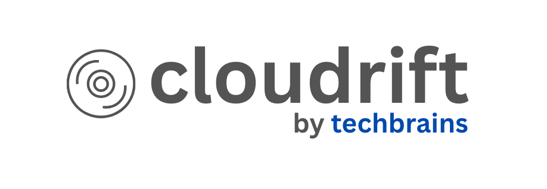

<p align="center">
  
  <h1 align="center">Cloudrift</h1>
  <p align="center">
    <strong>Pre-apply infrastructure governance for Terraform</strong>
  </p>
  <p align="center">
    Validate infrastructure changes against 49 compliance policies and live AWS state — before you apply
  </p>
</p>

<p align="center">
  <a href="LICENSE"></a>
  <a href="https://goreportcard.com/report/github.com/inayathulla/cloudrift"></a>
  <a href="https://github.com/inayathulla/cloudrift/actions/workflows/tests.yml"></a>
  <a href="https://hub.docker.com/r/inayathulla/cloudrift"></a>
  <a href="https://github.com/inayathulla/cloudrift/stargazers"></a>
</p>

<p align="center">
  <a href="https://tldrsec.com/p/tldr-sec-287"></a>
</p>

---

**Cloudrift** is an open-source infrastructure governance tool that validates your Terraform plans against live AWS state and security policies — catching misconfigurations **before** `terraform apply`, not after.

```
┌─────────────────────────────────────────────────────────────┐
│                  CLOUDRIFT UNIQUE POSITION                  │
│                                                             │
│   Terraform Plan  ──┐                                       │
│                     ├──▶  Policy Engine  ──▶  ALLOW/BLOCK  │
│   Live AWS State  ──┘        (OPA)                          │
│                                                             │
│   Competitors check EITHER plan OR live state               │
│   Cloudrift checks BOTH — catches drift AND policy violations│
└─────────────────────────────────────────────────────────────┘
```

## Table of Contents

- [Why Cloudrift?](#why-cloudrift)
- [Features](#features)
- [Compliance Frameworks](#compliance-frameworks)
- [Installation](#installation)
- [Quick Start](#quick-start)
- [Usage](#usage)
- [Output Formats](#output-formats)
- [Policy Engine](#policy-engine)
- [CI/CD Integration](#cicd-integration)
- [Desktop Dashboard](#desktop-dashboard)
- [Configuration](#configuration)
- [Project Structure](#project-structure)
- [Roadmap](#roadmap)
- [Contributing](#contributing)
- [Related Projects](#related-projects)
- [License](#license)

## Why Cloudrift?

| Feature | Cloudrift | Terraform Cloud | Checkov | driftctl |
|---------|-----------|-----------------|---------|----------|
| **Pre-apply validation** | ✅ | ❌ | ✅ | ❌ |
| **Live state comparison** | ✅ | ❌ | ❌ | ✅ |
| **Policy engine (OPA)** | ✅ | Sentinel ($$$) | ✅ | ❌ |
| **Compliance scoring** | ✅ | ❌ | ✅ | ❌ |
| **SARIF output** | ✅ | ❌ | ✅ | ❌ |
| **Open source** | ✅ | ❌ | ✅ | ✅ |
| **Self-hosted** | ✅ | ❌ | ✅ | ✅ |

**Key differentiator:** Cloudrift compares your Terraform plan against **live AWS state** — catching drift that would be silently overwritten by `terraform apply`.

## Features

- **Drift Detection** — Compare Terraform plans against live AWS infrastructure
- **49 Built-in Policies** — OPA security, tagging, and cost policies across 13 AWS resource types
- **5 Compliance Frameworks** — SOC 2 Type II, ISO 27001, PCI DSS, HIPAA, GDPR
- **Compliance Scoring** — Per-category and per-framework pass/fail percentages
- **Multiple Output Formats** — Console, JSON, SARIF for CI/CD integration
- **Multi-Service Support** — S3 buckets and EC2 instances (drift), 13 resource types (policies)
- **Custom Policies** — Extend with your own OPA `.rego` policies
- **CI/CD Ready** — GitHub Actions, GitLab CI, Jenkins with `--fail-on-violation`
- **GitHub Security Integration** — SARIF output for Security tab

## Compliance Frameworks

Cloudrift maps every built-in policy to industry compliance frameworks. Policy counts are computed dynamically from the `.rego` files — never hardcoded.

| Framework | Policies | Description |
|-----------|----------|-------------|
| **SOC 2 Type II** | 40 | Trust services criteria — security, availability, confidentiality |
| **ISO 27001** | 39 | Information security management system controls |
| **PCI DSS** | 34 | Payment card industry data security standard |
| **HIPAA** | 26 | Health data privacy and security rules |
| **GDPR** | 18 | EU data protection and privacy regulation |

### Framework Filtering

Use `--frameworks` to scope policy evaluation and compliance scoring to specific frameworks. Only policies mapped to at least one selected framework are evaluated and scored. Unknown framework names are rejected with a list of valid options.

```bash
# HIPAA-only compliance check
cloudrift scan --service=s3 --frameworks=hipaa

# Multiple frameworks
cloudrift scan --service=s3 --frameworks=hipaa,gdpr

# JSON output with framework filter (includes active_frameworks in response)
cloudrift scan --service=s3 --format=json --frameworks=soc2,pci_dss
```

When `--frameworks` is set, the compliance summary header shows the active filter and JSON output includes an `active_frameworks` array for downstream tooling.

### Policy Categories

| Category | Policies | Description |
|----------|----------|-------------|
| **Security** | 42 | Encryption, access control, network, IAM, audit logging |
| **Tagging** | 4 | Resource tagging for cost allocation and governance |
| **Cost** | 3 | Instance sizing and generation optimization |

## Installation

### Via Go

```bash
go install github.com/inayathulla/cloudrift@latest
```

### Via Docker

Pre-built images are available on [Docker Hub](https://hub.docker.com/r/inayathulla/cloudrift):

```bash
docker pull inayathulla/cloudrift:latest
```

| Tag | Description |
|-----|-------------|
| `latest` | Latest stable release |
| `v1.0.0` | Release 1 — S3/EC2 drift detection, OPA policies, SARIF output |
| `main` | Latest main branch build |

### Build from Source

```bash
git clone https://github.com/inayathulla/cloudrift.git
cd cloudrift
go build -o cloudrift .
```

## Quick Start

### 1. Generate a Terraform plan

```bash
cd your-terraform-project
terraform init
terraform plan -out=tfplan.binary
terraform show -json tfplan.binary > plan.json
```

### 2. Create a configuration file

Create `cloudrift.yml`:

```yaml
aws_profile: default
region: us-east-1
plan_path: ./plan.json
```

### 3. Run Cloudrift

```bash
# Scan S3 buckets
cloudrift scan --service=s3

# Scan EC2 instances
cloudrift scan --service=ec2

# Output as JSON with compliance scoring
cloudrift scan --service=s3 --format=json

# Fail CI/CD on policy violations
cloudrift scan --service=s3 --fail-on-violation

# Filter by compliance frameworks (only HIPAA + SOC 2)
cloudrift scan --service=s3 --frameworks=hipaa,soc2
```

## Usage

```bash
cloudrift scan [flags]
```

### Flags

| Flag | Short | Default | Description |
|------|-------|---------|-------------|
| `--config` | `-c` | `cloudrift.yml` | Path to configuration file |
| `--service` | `-s` | `s3` | AWS service to scan (s3, ec2) |
| `--format` | `-f` | `console` | Output format (console, json, sarif) |
| `--output` | `-o` | stdout | Write output to file |
| `--policy-dir` | `-p` | - | Directory with custom OPA policies |
| `--fail-on-violation` | - | `false` | Exit non-zero on violations |
| `--skip-policies` | - | `false` | Skip policy evaluation |
| `--no-emoji` | - | `false` | Use ASCII instead of emojis |
| `--frameworks` | - | all | Comma-separated compliance frameworks to evaluate (e.g., `hipaa,soc2`) |

### Supported Resources

**Drift detection** (plan vs live state comparison):

| Resource | Service Flag | Attributes Checked |
|----------|-------------|-------------------|
| S3 Buckets | `--service=s3` | ACL, tags, versioning, encryption, logging, public access block, lifecycle rules |
| EC2 Instances | `--service=ec2` | Instance type, AMI, subnet, security groups, tags, EBS optimization, monitoring |

**Policy evaluation** covers 13 AWS resource types (automatically applied during drift scans):

`aws_s3_bucket`, `aws_instance`, `aws_security_group`, `aws_db_instance`, `aws_iam_policy`, `aws_iam_role`, `aws_iam_user_policy`, `aws_cloudtrail`, `aws_kms_key`, `aws_lb`, `aws_lb_listener`, `aws_ebs_volume`, `aws_ebs_snapshot_copy`, `aws_lambda_function`, `aws_cloudwatch_log_group`, `aws_default_security_group`, `aws_subnet`, `aws_secretsmanager_secret`

## Output Formats

### Console (default)

```bash
cloudrift scan --service=s3
```

```
🚀 Starting Cloudrift scan...
🔐 Connected as: arn:aws:iam::123456789012:root [us-east-1]
✔️  Evaluated 49 policies in 23ms
⚠️  Found 2 policy violations

━━━━━━━━━━━━━━━━━━━━━━━━━━━━━━━━━━━━━━━━━━━━━━━━━━
              COMPLIANCE SUMMARY
━━━━━━━━━━━━━━━━━━━━━━━━━━━━━━━━━━━━━━━━━━━━━━━━━━

  Overall: 95.9% (47/49 policies passing)

  Categories:
    cost         100.0% (3/3)
    security     95.2% (40/42)
    tagging      100.0% (4/4)

  Frameworks:
    gdpr         94.4% (17/18)
    hipaa        96.2% (25/26)
    iso_27001    97.4% (38/39)
    pci_dss      97.1% (33/34)
    soc2         97.5% (39/40)
```

### JSON

```bash
cloudrift scan --service=s3 --format=json
```

```json
{
  "service": "S3",
  "account_id": "123456789012",
  "drift_count": 1,
  "policy_result": {
    "violations": [
      {
        "policy_id": "S3-001",
        "severity": "high",
        "category": "security",
        "frameworks": ["hipaa", "pci_dss", "iso_27001", "gdpr", "soc2"],
        "remediation": "Add server_side_encryption_configuration block"
      }
    ],
    "compliance": {
      "overall_percentage": 97.96,
      "total_policies": 49,
      "categories": { "security": { "percentage": 97.62, "passed": 41, "total": 42 } },
      "frameworks": { "soc2": { "percentage": 97.5, "passed": 39, "total": 40 } }
    }
  }
}
```

### SARIF (GitHub Security)

```bash
cloudrift scan --service=s3 --format=sarif --output=results.sarif
```

Upload to GitHub Code Scanning for Security tab integration.

## Policy Engine

Cloudrift includes **49 built-in OPA policies** across 17 `.rego` files, covering security, tagging, and cost optimization. All policies are embedded in the binary and loaded automatically.

### Security Policies (42 policies)

#### S3 Storage

| Policy | Severity | Rule | Frameworks |
|--------|----------|------|------------|
| S3-001 | high/critical | S3 encryption required (plan + live) | HIPAA, PCI DSS, ISO 27001, GDPR, SOC 2 |
| S3-002 | low | KMS encryption recommended over AES256 | HIPAA, PCI DSS, SOC 2 |
| S3-003 | high | Block public ACLs | HIPAA, GDPR, PCI DSS, ISO 27001, SOC 2 |
| S3-004 | high | Block public policy | HIPAA, GDPR, PCI DSS, ISO 27001, SOC 2 |
| S3-005 | high | Ignore public ACLs | HIPAA, GDPR, PCI DSS, ISO 27001, SOC 2 |
| S3-006 | high | Restrict public buckets | HIPAA, GDPR, PCI DSS, ISO 27001, SOC 2 |
| S3-007 | critical | No public-read ACL | HIPAA, GDPR, PCI DSS, ISO 27001, SOC 2 |
| S3-008 | critical | No public-read-write ACL | HIPAA, GDPR, PCI DSS, ISO 27001, SOC 2 |
| S3-009 | low | Versioning recommended | ISO 27001, SOC 2 |

#### EC2 Compute

| Policy | Severity | Rule | Frameworks |
|--------|----------|------|------------|
| EC2-001 | medium | IMDSv2 required | PCI DSS, ISO 27001, SOC 2 |
| EC2-002 | high | Root volume encryption | HIPAA, PCI DSS, ISO 27001, GDPR, SOC 2 |
| EC2-003 | medium | Public IP warning | PCI DSS, ISO 27001, SOC 2 |

#### Security Groups

| Policy | Severity | Rule | Frameworks |
|--------|----------|------|------------|
| SG-001 | critical | No unrestricted SSH (0.0.0.0/0 + ::/0) | PCI DSS, ISO 27001, SOC 2 |
| SG-002 | critical | No unrestricted RDP | PCI DSS, ISO 27001, SOC 2 |
| SG-003 | critical | No unrestricted all-ports | PCI DSS, ISO 27001, SOC 2 |
| SG-004 | high | Database ports not public | HIPAA, PCI DSS, ISO 27001, SOC 2 |

#### RDS Databases

| Policy | Severity | Rule | Frameworks |
|--------|----------|------|------------|
| RDS-001 | high | Storage encryption required | HIPAA, PCI DSS, ISO 27001, GDPR, SOC 2 |
| RDS-002 | critical | No public access | HIPAA, PCI DSS, ISO 27001, GDPR, SOC 2 |
| RDS-003 | medium | Backup retention >= 7 days | HIPAA, ISO 27001, SOC 2 |
| RDS-004 | medium | Deletion protection enabled | ISO 27001, SOC 2 |
| RDS-005 | low | Multi-AZ recommended | HIPAA, ISO 27001, SOC 2 |

#### IAM

| Policy | Severity | Rule | Frameworks |
|--------|----------|------|------------|
| IAM-001 | critical | No wildcard (*) IAM actions | HIPAA, PCI DSS, ISO 27001, GDPR, SOC 2 |
| IAM-002 | medium | No inline policies on users | PCI DSS, ISO 27001, SOC 2 |
| IAM-003 | high | Role trust not overly broad | PCI DSS, ISO 27001, SOC 2 |

#### CloudTrail

| Policy | Severity | Rule | Frameworks |
|--------|----------|------|------------|
| CT-001 | high | KMS encryption required | HIPAA, PCI DSS, ISO 27001, GDPR, SOC 2 |
| CT-002 | medium | Log file validation enabled | PCI DSS, ISO 27001, SOC 2 |
| CT-003 | medium | Multi-region trail | HIPAA, PCI DSS, ISO 27001, SOC 2 |

#### KMS

| Policy | Severity | Rule | Frameworks |
|--------|----------|------|------------|
| KMS-001 | high | Key rotation enabled | HIPAA, PCI DSS, ISO 27001, SOC 2 |
| KMS-002 | medium | Deletion window >= 14 days | ISO 27001, SOC 2 |

#### ELB / ALB

| Policy | Severity | Rule | Frameworks |
|--------|----------|------|------------|
| ELB-001 | medium | Access logging enabled | HIPAA, PCI DSS, ISO 27001, SOC 2 |
| ELB-002 | high | HTTPS listener required | HIPAA, PCI DSS, ISO 27001, GDPR, SOC 2 |
| ELB-003 | medium | Deletion protection enabled | ISO 27001, SOC 2 |

#### EBS

| Policy | Severity | Rule | Frameworks |
|--------|----------|------|------------|
| EBS-001 | high | Volume encryption required | HIPAA, PCI DSS, ISO 27001, GDPR, SOC 2 |
| EBS-002 | high | Snapshot encryption required | HIPAA, PCI DSS, ISO 27001, GDPR |

#### Lambda

| Policy | Severity | Rule | Frameworks |
|--------|----------|------|------------|
| LAMBDA-001 | medium | X-Ray tracing enabled | SOC 2, ISO 27001 |
| LAMBDA-002 | medium | VPC configuration recommended | HIPAA, PCI DSS, ISO 27001 |

#### CloudWatch

| Policy | Severity | Rule | Frameworks |
|--------|----------|------|------------|
| LOG-001 | medium | Log group KMS encryption | HIPAA, PCI DSS, GDPR, SOC 2 |
| LOG-002 | medium | Log retention policy set | HIPAA, GDPR, SOC 2, ISO 27001 |

#### VPC / Networking

| Policy | Severity | Rule | Frameworks |
|--------|----------|------|------------|
| VPC-001 | high | Default security group blocks all traffic | PCI DSS, ISO 27001, SOC 2 |
| VPC-002 | medium | No auto-assign public IP on subnets | PCI DSS, ISO 27001 |

#### Secrets Manager

| Policy | Severity | Rule | Frameworks |
|--------|----------|------|------------|
| SECRET-001 | medium | Customer-managed KMS encryption | HIPAA, PCI DSS, GDPR, SOC 2 |
| SECRET-002 | medium | Automatic rotation configured | PCI DSS, ISO 27001, SOC 2 |

### Tagging Policies (4 policies)

| Policy | Severity | Rule |
|--------|----------|------|
| TAG-001 | medium | Environment tag required (SOC 2) |
| TAG-002 | low | Owner tag recommended |
| TAG-003 | low | Project tag recommended |
| TAG-004 | low | Name tag recommended |

TAG policies apply to all taggable resource types: S3, EC2, Security Groups, RDS, Lambda, ECS, EKS, ALB, VPC, EBS, KMS, CloudTrail, CloudWatch, Secrets Manager.

### Cost Policies (3 policies)

| Policy | Severity | Rule |
|--------|----------|------|
| EC2-005 | medium | Very large instance type review |
| COST-002 | medium/low | Very large instance size (24xlarge/16xlarge) |
| COST-003 | low | Previous generation instance family |

### Custom Policies

Extend Cloudrift with your own OPA policies:

```rego
# my-policies/custom.rego
package cloudrift.custom

deny[result] {
    input.resource.type == "aws_s3_bucket"
    not input.resource.planned.tags.CostCenter

    result := {
        "policy_id": "CUSTOM-001",
        "policy_name": "CostCenter Tag Required",
        "msg": sprintf("S3 bucket '%s' must have CostCenter tag", [input.resource.address]),
        "severity": "medium",
        "remediation": "Add tags = { CostCenter = \"...\" }",
        "category": "tagging",
        "frameworks": ["soc2"],
    }
}
```

```bash
cloudrift scan --service=s3 --policy-dir=./my-policies
```

Custom policies are loaded alongside built-in policies. Use `deny` rules for violations (block CI/CD with `--fail-on-violation`) and `warn` rules for advisory findings.

## CI/CD Integration

### GitHub Actions

```yaml
name: Drift Detection
on: [pull_request]

jobs:
  drift-scan:
    runs-on: ubuntu-latest
    steps:
      - uses: actions/checkout@v4

      - name: Setup Terraform
        uses: hashicorp/setup-terraform@v3

      - name: Terraform Plan
        run: |
          terraform init
          terraform plan -out=tfplan.binary
          terraform show -json tfplan.binary > plan.json

      - name: Install Cloudrift
        run: go install github.com/inayathulla/cloudrift@latest

      - name: Run Drift Scan
        run: cloudrift scan --service=s3 --format=sarif --output=results.sarif --fail-on-violation
        env:
          AWS_ACCESS_KEY_ID: ${{ secrets.AWS_ACCESS_KEY_ID }}
          AWS_SECRET_ACCESS_KEY: ${{ secrets.AWS_SECRET_ACCESS_KEY }}

      - name: Upload SARIF
        uses: github/codeql-action/upload-sarif@v2
        if: always()
        with:
          sarif_file: results.sarif
```

### GitLab CI

```yaml
drift-scan:
  image: golang:1.24
  script:
    - go install github.com/inayathulla/cloudrift@latest
    - terraform init && terraform plan -out=tfplan.binary
    - terraform show -json tfplan.binary > plan.json
    - cloudrift scan --service=s3 --format=json --fail-on-violation
```

## Desktop Dashboard

**[Cloudrift UI](https://github.com/inayathulla/cloudrift-ui)** is a cross-platform dashboard that visualizes Cloudrift scan results. It runs **two ways**:

- **Web via Docker** — One command deploys a container with Flutter web app, Go API server, nginx, and Terraform. Zero dependencies.
- **Native Desktop** — Runs on macOS, Linux, or Windows, calling the CLI binary directly. No server needed.

### Quick Start (Docker)

```bash
docker build -t cloudrift-ui .
docker run -d -p 8080:80 -v ~/.aws:/root/.aws:ro --name cloudrift-ui cloudrift-ui:latest
open http://localhost:8080
```

### Quick Start (Desktop)

```bash
git clone https://github.com/inayathulla/cloudrift-ui.git
cd cloudrift-ui
flutter pub get && flutter run -d macos   # or -d linux / -d windows
```

### Key Features

| Feature | Description |
|---------|-------------|
| **Interactive Dashboard** | Clickable KPI cards, drift trend charts, severity donut, framework compliance rings |
| **Drift Visualization** | Three-column diff viewer: Attribute / Expected (Terraform) / Actual (AWS) |
| **Resource Builder** | Three modes: Terraform (auto-generate plan.json), Manual (S3/EC2 forms), Upload (drag & drop) |
| **Policy Dashboard** | 49 OPA policies with compliance mapping (SOC 2, HIPAA, GDPR, ISO 27001, PCI DSS), severity filters, remediation guidance |
| **Compliance Scoring** | Animated compliance rings with category breakdowns and trend tracking |
| **Scan History** | Persistent local history with trend charts and human-readable durations |
| **Go API Server** | Backend wrapping Cloudrift CLI for web mode — scan, config, health, Terraform plan generation |
| **Dark Theme** | Cybersecurity-grade dark theme with severity-coded color system |

See the [Cloudrift UI README](https://github.com/inayathulla/cloudrift-ui) for full documentation and screenshots.

## Configuration

| Field | Description | Required |
|-------|-------------|----------|
| `aws_profile` | AWS credentials profile name | Yes |
| `region` | AWS region to scan | Yes |
| `plan_path` | Path to Terraform plan JSON | Yes |

### Example Configurations

**S3 Scanning:**
```yaml
# config/cloudrift.yml
aws_profile: default
region: us-east-1
plan_path: ./examples/plan.json
```

**EC2 Scanning:**
```yaml
# config/cloudrift-ec2.yml
aws_profile: default
region: us-east-1
plan_path: ./examples/ec2-plan.json
```

## Project Structure

```
cloudrift/
├── cmd/                          # CLI commands
│   ├── root.go
│   └── scan.go                   # Scan command with compliance scoring
├── internal/
│   ├── aws/                      # AWS API integrations
│   │   ├── config.go             # AWS SDK configuration
│   │   ├── s3.go                 # S3 API client
│   │   └── ec2.go                # EC2 API client
│   ├── detector/                 # Drift detection logic
│   │   ├── interface.go          # Detector interface
│   │   ├── s3.go                 # S3 drift detector
│   │   ├── ec2.go                # EC2 drift detector
│   │   ├── s3_printer.go         # S3 console output
│   │   └── ec2_printer.go        # EC2 console output
│   ├── output/                   # Output formatters
│   │   ├── formatter.go          # Format types, compliance structs
│   │   ├── json.go               # JSON formatter
│   │   ├── sarif.go              # SARIF formatter
│   │   └── console.go            # Console formatter
│   ├── policy/                   # OPA policy engine
│   │   ├── engine.go             # Policy evaluation (deny/warn rules)
│   │   ├── loader.go             # Embedded policy loading
│   │   ├── registry.go           # Dynamic policy metadata extraction
│   │   ├── result.go             # Violation, EvaluationResult structs
│   │   ├── input.go              # PolicyInput structs
│   │   └── policies/             # 49 built-in OPA policies
│   │       ├── security/         # 42 security policies (17 .rego files)
│   │       ├── tagging/          # 4 tagging policies
│   │       └── cost/             # 3 cost policies
│   ├── models/                   # Data structures (S3Bucket, EC2Instance)
│   └── parser/                   # Terraform plan JSON parser
├── tests/                        # Unit tests
│   └── internal/
│       ├── detector/             # Drift detection tests
│       ├── output/               # Formatter tests
│       ├── parser/               # Parser tests
│       └── policy/               # Policy engine + registry tests
├── config/                       # Example configurations
├── examples/                     # Example Terraform plans
└── docs/                         # Documentation
```

## Roadmap

### Completed ✅
- [x] S3 drift detection
- [x] EC2 drift detection
- [x] JSON output format
- [x] SARIF output format
- [x] OPA policy engine with 49 built-in policies
- [x] 5 compliance frameworks (SOC 2, ISO 27001, PCI DSS, HIPAA, GDPR)
- [x] Compliance scoring (overall, per-category, per-framework)
- [x] Dynamic policy registry (no hardcoded counts)
- [x] Custom policy support
- [x] `--fail-on-violation` flag for CI/CD
- [x] Desktop dashboard ([Cloudrift UI](https://github.com/inayathulla/cloudrift-ui))

### In Progress 🚧
- [ ] IAM drift detection
- [ ] Security Groups drift detection
- [ ] RDS drift detection

### Planned 📋
- [ ] CIS AWS Foundations Benchmark policies
- [ ] Multi-account scanning
- [ ] Slack/PagerDuty alert integration
- [ ] Policy exception management

## Contributing

Contributions are welcome!

```bash
# Clone
git clone https://github.com/inayathulla/cloudrift.git
cd cloudrift

# Build
go build -o cloudrift .

# Test
go test ./...

# Run
./cloudrift scan --service=s3 --config=config/cloudrift.yml
```

### Adding a New Policy

1. Create or edit a `.rego` file under `internal/policy/policies/<category>/`
2. Use `deny[result]` for violations or `warn[result]` for warnings
3. Include `policy_id`, `policy_name`, `msg`, `severity`, `remediation`, `category`, and `frameworks` in the result object
4. Policy counts update automatically via the dynamic registry — no hardcoded values to change
5. Run `go test ./...` to verify

## Related Projects

| Project | Description |
|---------|-------------|
| **[Cloudrift UI](https://github.com/inayathulla/cloudrift-ui)** | Cross-platform security dashboard (Flutter) — Desktop + Web/Docker. Drift diff viewer, resource builder, 49-policy browser with SOC 2/HIPAA/GDPR/ISO 27001/PCI DSS mapping, compliance scoring, Go API server, and dark cybersecurity theme. |

## Connect

- **Issues & Features:** [GitHub Issues](https://github.com/inayathulla/cloudrift/issues)
- **Email:** [inayathulla2020@gmail.com](mailto:inayathulla2020@gmail.com)
- **LinkedIn:** [Inayathulla Khan Lavani](https://www.linkedin.com/in/inayathullakhan)

---

## License

[Apache License 2.0](LICENSE)

---

<p align="center">
  <sub>Built for DevOps teams who believe in shift-left infrastructure governance</sub>
</p>
