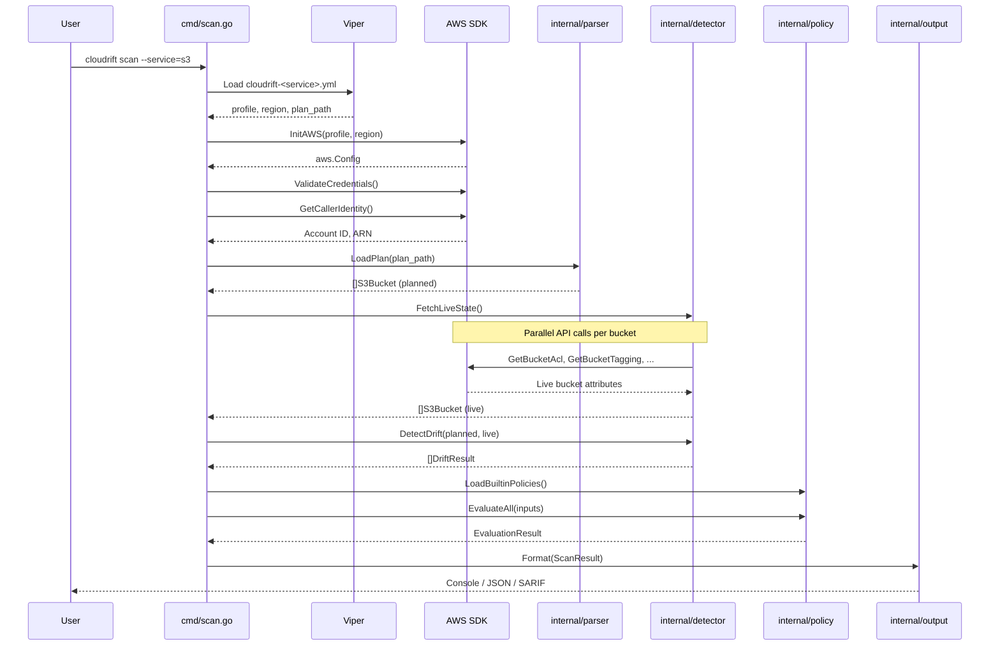
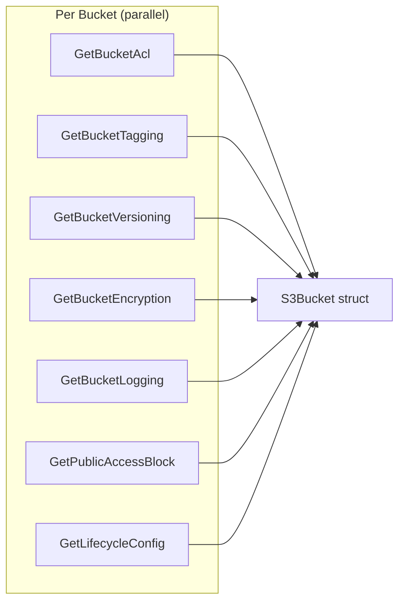

# Data Flow

This page traces a complete scan from CLI invocation to output.

## Sequence Diagram



---

## Step-by-Step Flow

### 1. Configuration Loading

```
cloudrift-<service>.yml → Viper → (profile, region, plan_path)
```

Viper reads the YAML config file and extracts AWS profile, region, and Terraform plan path.

### 2. AWS Initialization

```
profile + region → AWS SDK v2 → aws.Config
aws.Config → STS GetCallerIdentity → Account ID
```

The AWS SDK is initialized with the configured profile and region. Credentials are validated via `GetCallerIdentity`.

### 3. Plan Parsing

```
plan.json → resource_changes[].change.after → []S3Bucket
```

The Terraform plan JSON is parsed to extract resources matching the selected service. Each resource's planned attributes are mapped to the service model (e.g., `S3Bucket` struct).

### 4. Live State Fetching

For S3, each bucket's attributes are fetched concurrently:



Expected errors (e.g., `NoSuchTagSet`) are silently ignored. Unexpected errors are logged but don't stop the scan.

### 5. Drift Detection

```
planned[]  ──┐
              ├── Compare attributes → DriftResult[]
live[]     ──┘
```

For each resource, the detector compares planned vs live attributes:

- **Missing**: Resource in plan but not in AWS
- **Diffs**: Attribute values differ (e.g., versioning enabled vs disabled)
- **Extra tags**: Tags in AWS not in the plan

### 6. Policy Evaluation

```
Resources → PolicyInput[] → OPA Compiler → deny[] + warn[]
```

Resources are converted to OPA inputs. The compiler evaluates all `.rego` modules:

- `deny` rules produce violations (blocking)
- `warn` rules produce warnings (advisory)

Each violation includes policy ID, name, severity, remediation, category, and framework mappings.

### 7. Output Formatting

The formatter converts results to the requested format:

| Format | Handler | Output |
|--------|---------|--------|
| `console` | Legacy printer + `printPolicyResults()` | Colorized terminal output |
| `json` | `JSONFormatter` | Structured JSON |
| `sarif` | `SARIFFormatter` | SARIF 2.1.0 JSON |

---

## Error Handling Strategy

| Error Type | Behavior |
|-----------|---------|
| Config file not found | Exit with error |
| Invalid AWS credentials | Exit with error |
| Plan file parse error | Exit with error |
| AWS API rate limit | Retry (SDK built-in) |
| Missing optional attribute (NoSuchTagSet) | Silently ignore |
| Individual resource fetch error | Log warning, continue scan |
| Policy compilation error | Log warning, skip policies |
| Policy evaluation error | Log warning, skip policies |
