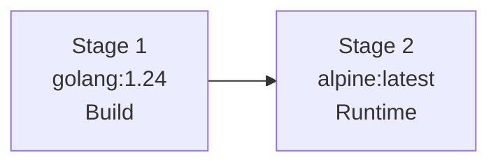

# Deployment

## Docker

The Docker image uses a 2-stage multi-stage build to produce a minimal Alpine runtime container.

### Build Stages



#### Stage 1: Build

```dockerfile
FROM golang:1.24 AS build
ENV CGO_ENABLED=0 GOOS=linux GOARCH=amd64
# Downloads dependencies, compiles static binary
# Output: /app/cloudrift
```

Produces a statically-linked Linux binary with `CGO_ENABLED=0` for maximum portability.

#### Stage 2: Runtime

```dockerfile
FROM alpine:latest
# Creates non-root 'cloudrift' user
# Copies binary from build stage
# ENTRYPOINT ["/cloudrift"]
```

The final image is minimal — only Alpine + the compiled binary, running as a non-root user.

### Building the Image

```bash
docker build -t cloudrift .
```

### Running

```bash
docker run --rm \
  -v ~/.aws:/root/.aws:ro \
  -v $(pwd):/work \
  cloudrift scan \
  --config=/work/cloudrift.yml \
  --service=s3
```

!!! warning "AWS credentials"
    Mount `~/.aws` as read-only (`:ro`) to provide credentials. Never bake credentials into the image.

### Docker Hub

```bash
docker pull inayathulla/cloudrift:latest
```

| Tag | Description |
|-----|-------------|
| `latest` | Latest stable release |
| `v1.0.0` | Specific version |

---

## Go Binary

### go install

```bash
go install github.com/inayathulla/cloudrift@latest
```

The binary is installed to `$GOPATH/bin/cloudrift` (typically `~/go/bin/cloudrift`).

### Build from Source

```bash
git clone https://github.com/inayathulla/cloudrift.git
cd cloudrift
go build -o cloudrift main.go
```

### Cross-Compilation

Build for different platforms:

```bash
# Linux (amd64)
GOOS=linux GOARCH=amd64 go build -o cloudrift-linux main.go

# macOS (Apple Silicon)
GOOS=darwin GOARCH=arm64 go build -o cloudrift-darwin main.go

# Windows
GOOS=windows GOARCH=amd64 go build -o cloudrift.exe main.go
```

---

## CI/CD Pipeline Deployment

Cloudrift is designed for CI/CD integration. See [CI/CD Integration](../features/ci-cd.md) for complete GitHub Actions and GitLab CI workflows.

### Quick Reference

```bash
# Install in CI
go install github.com/inayathulla/cloudrift@latest

# Or use Docker
docker run --rm \
  -e AWS_ACCESS_KEY_ID=$AWS_ACCESS_KEY_ID \
  -e AWS_SECRET_ACCESS_KEY=$AWS_SECRET_ACCESS_KEY \
  -v $(pwd):/work \
  inayathulla/cloudrift:latest scan \
  --config=/work/cloudrift.yml \
  --service=s3 \
  --fail-on-violation \
  --no-emoji
```

---

## GitHub Pages (Documentation)

The documentation site is built with MkDocs Material and can be deployed via GitHub Actions:

```yaml
name: Deploy Docs
on:
  push:
    branches: [main]
    paths: ['docs/**', 'mkdocs.yml']

permissions:
  contents: write

jobs:
  deploy:
    runs-on: ubuntu-latest
    steps:
      - uses: actions/checkout@v4
      - uses: actions/setup-python@v5
        with:
          python-version: '3.x'
      - run: pip install mkdocs-material mkdocs-minify-plugin
      - run: mkdocs gh-deploy --force
```

Build locally with:

```bash
mkdocs build --strict
mkdocs serve  # Preview at http://localhost:8000
```
