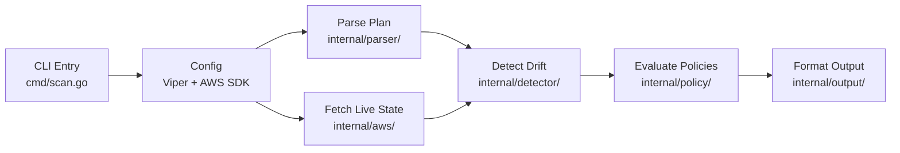
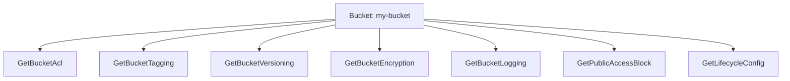

# Architecture Overview

Cloudrift follows a **pipeline architecture** where each scan step feeds into the next. The codebase uses Go's modular package system with clear separation between CLI, parsing, AWS integration, detection, policy evaluation, and output formatting.

## Pipeline Diagram

---

## Tech Stack

| Component | Technology | Version | Purpose |
|-----------|-----------|---------|---------|
| **Language** | Go | 1.24 | Core language |
| **CLI Framework** | Cobra | 1.10 | Command-line interface |
| **Config** | Viper | 1.21 | YAML configuration loading |
| **AWS SDK** | AWS SDK for Go v2 | 1.41 | S3, EC2, IAM, STS API calls |
| **Policy Engine** | Open Policy Agent | 1.13 | OPA/Rego policy evaluation |
| **Testing** | Testify | 1.11 | Assertion library |
| **Console** | fatih/color | 1.16 | Colorized terminal output |
| **Progress** | briandowns/spinner | 1.23 | CLI progress indicators |
| **Concurrency** | golang.org/x/sync | 0.19 | errgroup for parallel API calls |

---

## Key Design Decisions

### Pre-Apply Detection

Unlike post-apply tools (driftctl, Terraform Cloud drift detection), Cloudrift operates on the Terraform **plan** file — before any changes are applied. This enables:

- CI/CD gating before deployment
- Code review with drift context
- Zero risk of modifying infrastructure

### Parallel AWS API Calls

S3 bucket attributes are fetched concurrently using `errgroup.WithContext`. Each bucket triggers 7 parallel API calls (ACL, tags, versioning, encryption, logging, public access block, lifecycle), reducing latency.

### Embedded Policies

All 49 `.rego` policy files are embedded in the binary via Go's `//go:embed` directive. This means:

- No external files required at runtime
- Policies versioned with the binary
- Custom policies can be loaded alongside built-ins via `--policy-dir`

### Dynamic Policy Registry

Policy metadata (IDs, categories, frameworks) is extracted from `.rego` files at runtime using regex — never hardcoded. This ensures counts stay accurate as policies are added.

### Service-Based Modularity

Each AWS service follows the same pattern with dedicated files:

| Component | S3 File | EC2 File | IAM File |
|-----------|---------|----------|----------|
| Parser | `internal/parser/s3.go` | `internal/parser/ec2.go` | `internal/parser/iam.go` |
| AWS Client | `internal/aws/s3.go` | `internal/aws/ec2.go` | `internal/aws/iam.go` |
| Detector | `internal/detector/s3.go` | `internal/detector/ec2.go` | `internal/detector/iam.go` |
| Printer | `internal/detector/s3_printer.go` | `internal/detector/ec2_printer.go` | `internal/detector/iam_printer.go` |
| Model | `internal/models/s3.go` | `internal/models/ec2.go` | `internal/models/iam.go` |

Adding a new service means creating one file per component and registering it in `cmd/scan.go`.

### Graceful Error Handling

AWS API calls for optional attributes (tags, lifecycle, etc.) gracefully handle "not found" errors. For example, `NoSuchTagSet` or `NoSuchLifecycleConfiguration` are expected for buckets without those features configured — these are silently ignored rather than causing scan failures.
