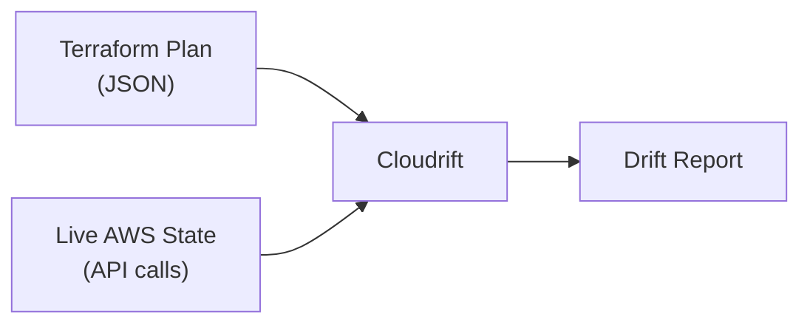

# Drift Detection

Cloudrift detects configuration drift by comparing your Terraform plan JSON against the actual state of AWS resources. Unlike post-apply tools like driftctl, Cloudrift catches drift **before** `terraform apply`.

## How It Works



1. **Parse** — Cloudrift reads `resource_changes[].change.after` from your Terraform plan JSON
2. **Fetch** — Queries AWS APIs for the current state of each resource
3. **Compare** — Attribute-by-attribute comparison between planned and live state
4. **Report** — Outputs differences with severity levels

---

## Supported Services

### S3 Buckets

| Attribute | Description |
|-----------|-------------|
| ACL | Bucket access control list (private, public-read, etc.) |
| Tags | Resource tags (key-value pairs) |
| Versioning | Whether versioning is enabled |
| Encryption | Server-side encryption algorithm (AES256, aws:kms) |
| Logging | Access logging configuration |
| Public Access Block | Block public ACLs, policies, and bucket access |
| Lifecycle Rules | Object lifecycle management rules |

S3 attributes are fetched in parallel using Go's `errgroup` — all 7 API calls per bucket run concurrently.

### EC2 Instances

| Attribute | Description |
|-----------|-------------|
| Instance Type | Instance size (t3.micro, m5.large, etc.) |
| AMI | Amazon Machine Image ID |
| Subnet | VPC subnet placement |
| Security Groups | Attached security group IDs |
| Tags | Resource tags |
| EBS Optimization | Whether EBS-optimized storage is enabled |
| Monitoring | Detailed monitoring status |

EC2 instances are fetched with pagination to support large fleets.

### IAM Resources

| Attribute | Description |
|-----------|-------------|
| Roles — Trust Policy | AssumeRolePolicyDocument (JSON-normalized comparison) |
| Roles — Max Session | Maximum session duration in seconds |
| Roles — Description | Role description text |
| Roles — Path | IAM path for the role |
| Roles — Attached Policies | Managed policy ARNs attached to the role |
| Users — Path | IAM path for the user |
| Users — Attached Policies | Managed policy ARNs attached to the user |
| Policies — Document | Policy document JSON (JSON-normalized comparison) |
| Policies — Description | Policy description text |
| Policies — Path | IAM path for the policy |
| Groups — Path | IAM path for the group |
| Groups — Attached Policies | Managed policy ARNs attached to the group |
| Groups — Members | Group membership (user names) |
| All — Tags | Resource tags (key-value pairs) |

IAM resources (roles, users, policies, groups) are fetched in parallel using `errgroup`. AWS service-linked roles and AWS-managed policies are excluded to focus on customer-managed resources. Policy documents and trust policies are compared using JSON normalization to avoid false positives from formatting differences.

---

## Drift Types

### Missing Resources

A resource exists in the Terraform plan but not in AWS. This is flagged as **critical** severity.

```
❌ MISSING: S3 bucket "my-bucket" exists in plan but not in AWS
```

### Attribute Differences

A resource exists in both plan and AWS but has different attribute values.

```
⚠️  DRIFT: my-bucket
  versioning_enabled: true → false
  encryption_algorithm: aws:kms → AES256
```

### Extra Tags

Tags exist in AWS but are not defined in the Terraform plan.

```
ℹ️  EXTRA TAGS: my-bucket
  ManagedBy: manual (not in plan)
```

---

## Pre-Apply vs Post-Apply

| Aspect | Cloudrift (Pre-Apply) | driftctl (Post-Apply) |
|--------|----------------------|----------------------|
| **When** | Before `terraform apply` | After `terraform apply` |
| **Input** | Terraform plan JSON | Terraform state file |
| **Catches** | Config someone changed manually | State file vs live |
| **Use case** | CI/CD gate, code review | Ongoing monitoring |
| **Risk** | None — read-only | None — read-only |

!!! tip "Complementary tools"
    Cloudrift and post-apply tools serve different purposes. Use Cloudrift in CI/CD to catch drift before deploying, and a post-apply tool for ongoing monitoring.
