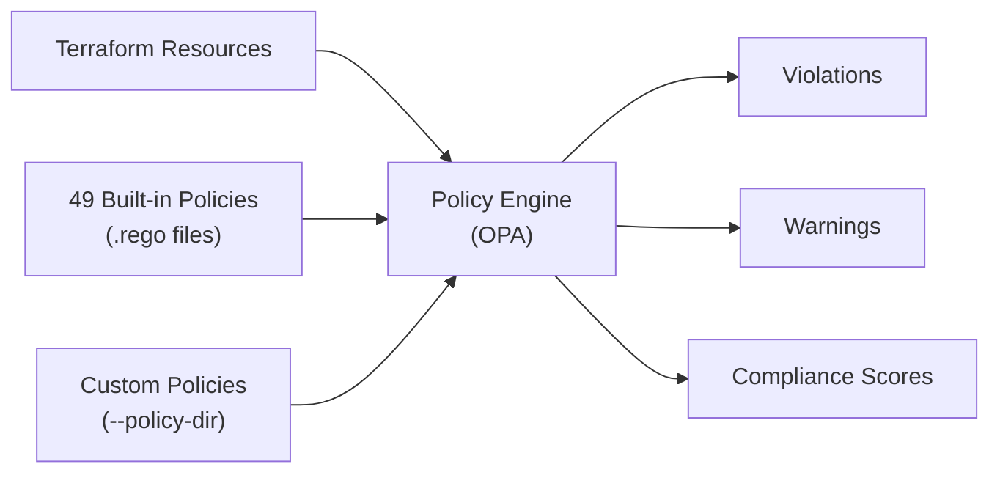

# Policy Engine

Cloudrift includes a built-in policy engine powered by [Open Policy Agent (OPA)](https://www.openpolicyagent.org/). It evaluates 49 security, tagging, and cost policies against your Terraform resources.

## How It Works



1. Resources from the Terraform plan are converted to policy inputs
2. The OPA compiler evaluates all `.rego` policies against each resource
3. `deny` rules produce **violations** (blocking findings)
4. `warn` rules produce **warnings** (advisory findings)
5. Compliance scores are computed from pass/fail counts

---

## Built-in Policies

Cloudrift ships with 49 policies embedded in the binary:

| Category | Policies | Description |
|----------|----------|-------------|
| **Security** | 42 | Encryption, access control, network, IAM, audit logging |
| **Tagging** | 4 | Resource tagging for governance and cost allocation |
| **Cost** | 3 | Instance sizing and generation optimization |

See the [Policy Reference](../policies/overview.md) for the full list.

---

## Custom Policies

Add your own OPA policies with `--policy-dir`:

```bash
cloudrift scan --service=s3 --policy-dir=./my-policies
```

Custom policies are loaded alongside built-in policies. Place `.rego` files in the specified directory.

### Writing a Custom Policy

```rego
package cloudrift.custom

deny[result] {
    input.resource.type == "aws_s3_bucket"
    not input.resource.planned.tags.Team

    result := {
        "policy_id": "CUSTOM-001",
        "policy_name": "Team Tag Required",
        "msg": sprintf("S3 bucket '%s' is missing required 'Team' tag", [input.resource.address]),
        "severity": "medium",
        "remediation": "Add tags = { Team = \"your-team\" } to the resource",
        "category": "tagging",
        "frameworks": ["soc2"],
    }
}
```

### Policy Structure

Every policy result must include:

| Field | Type | Required | Description |
|-------|------|----------|-------------|
| `policy_id` | string | yes | Unique identifier (e.g., "CUSTOM-001") |
| `policy_name` | string | yes | Human-readable name |
| `msg` | string | yes | Violation description |
| `severity` | string | yes | `critical`, `high`, `medium`, `low`, `info` |
| `remediation` | string | no | Fix guidance |
| `category` | string | no | `security`, `tagging`, `cost` |
| `frameworks` | array | no | Compliance frameworks (`hipaa`, `gdpr`, `iso_27001`, `pci_dss`, `soc2`) |

### Policy Input

Each resource is provided as an OPA input with this structure:

```json
{
  "resource": {
    "type": "aws_s3_bucket",
    "address": "aws_s3_bucket.my_bucket",
    "planned": {
      "bucket": "my-bucket",
      "acl": "private",
      "tags": { "Environment": "prod" },
      "versioning_enabled": true,
      "encryption_algorithm": "AES256",
      "logging_enabled": false,
      "public_access_block": {
        "block_public_acls": true,
        "block_public_policy": true,
        "ignore_public_acls": true,
        "restrict_public_buckets": true
      }
    },
    "drift": {
      "has_drift": false,
      "missing": false
    }
  }
}
```

---

## Skipping Policies

To run drift detection without policy evaluation:

```bash
cloudrift scan --service=s3 --skip-policies
```

---

## Policy Loading

Policies are embedded in the Cloudrift binary using Go's `//go:embed` directive. At runtime:

1. Embedded `.rego` files are extracted to a temporary directory
2. OPA compiler parses and compiles all modules together
3. The temporary directory is cleaned up after compilation
4. Compiled modules remain in memory for evaluation

Custom policies (from `--policy-dir`) are loaded and compiled alongside built-in policies.
